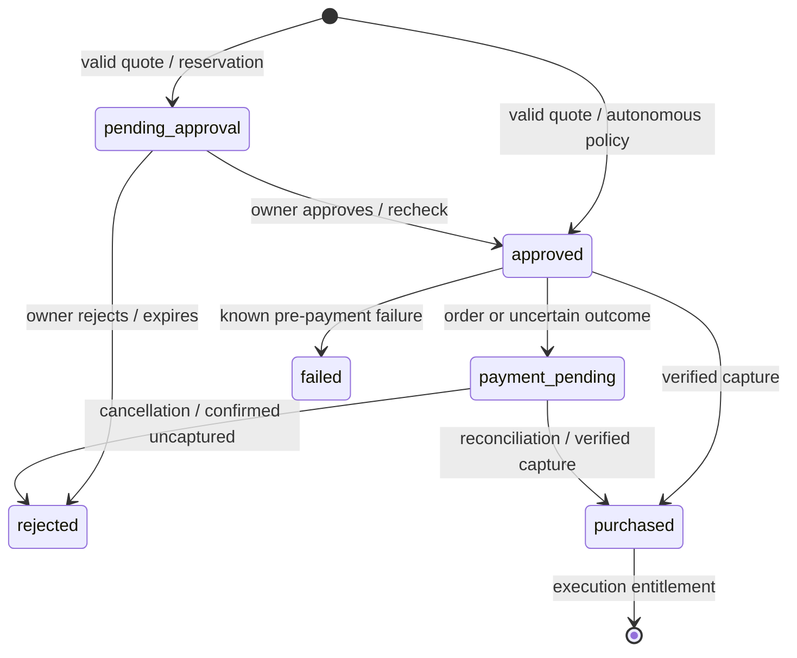

# Architecture and security decisions

## Runtime and ownership

One Cloudflare Worker hosts Hono REST routes, an official SDK Streamable HTTP MCP endpoint, static frontend assets, the Queue consumer, and a scheduled recovery handler. React never calls PayPal or a provider directly. REST and MCP invoke the same domain services under `apps/worker/src/services`.

Each email/password account has its own workspace. A Better Auth session stored in D1 identifies its user; hashed Bearer tokens identify individual buyer agents. Agent policies, approvals, purchases, invocations, jobs, providers, and uploaded datasets are checked against their owner. The public catalog omits provider endpoints and secrets. Agent tokens cannot approve purchases or administer providers.

Both local and remote dashboards require individual email/password login. Better Auth hashes passwords with scrypt and uses expiring, revocable D1 sessions with HttpOnly/SameSite cookies. See [authentication](authentication.md) for owner migration and limits. JSON mutations check the request origin; foreign MCP origins are rejected. Provider and saved-payment secrets use AES-GCM encryption with an operator-managed key. Logs contain correlation IDs, event names, and record IDs rather than request bodies or secrets.

## Storage

`packages/db/src/schema.ts` defines the Drizzle D1 model. Tracked migrations are the source of database evolution. Monetary amounts are integer USD cents, domain timestamps are ISO UTC and authentication session/account timestamps are epoch milliseconds, and budget days are UTC calendar dates. Foreign keys and unique constraints protect identities, one purchase per quote, and one invocation per purchase.

| Store          | Contents                                                                                                                                         |
| -------------- | ------------------------------------------------------------------------------------------------------------------------------------------------ |
| D1             | Users, agents, policies, catalog, quotes, purchases, transactions, approvals, invocations, jobs, reviews, activity, billing setup, rate counters |
| R2             | Owned uploaded JSON datasets and results over 16 KiB                                                                                             |
| Queue          | Invocation/job identifiers; provider credentials remain in D1 encrypted                                                                          |
| Worker secrets | Session key, encryption key, provider demo authentication, PayPal Sandbox credentials                                                            |

Quotes retain their intended arguments so a confirmed purchase can execute later. Invocation inputs and results are owner-accessible, not public. Activity and structured logs are metadata-only. Expired authentication records and rate counters are cleaned up; other application records have no automatic retention/deletion policy; real private-data integrations need a defined retention policy and stronger human identity before rollout.

## Commerce invariants

1. A quote validates the capability's input schema and fixes its version, amount, input hash, agent, and five-minute expiration.
2. A conditional D1 insert checks the live policy, enabled agent/capability, quote version and expiry, transaction ceiling, and the sum of committed/reserved purchases. Checking and reserving happen in one SQL statement.
3. Purchases at or below the auto threshold proceed when autonomy is enabled. Other allowed purchases reserve their amount and create an owner approval. Limits apply to both paths.
4. Approval rechecks current identity, policy, capability version, and budget before proceeding. Rejection or known pre-payment failure releases the reservation. Pending approvals expire after 24 hours through scheduled recovery.
5. Payment uses a two-minute D1 lease and stable operation-specific PayPal request IDs. A verified capture must match the purchase reference, USD currency, exact amount, and completed status.
6. Uncertain payment outcomes retain their budget reservation and cannot invoke. Reconciliation checks the known order; old unknown order creation is not blindly repeated beyond five hours. Payment mode cannot change underneath a purchase.
7. The receipt and purchase transition are persisted in a D1 batch. Only a purchased entitlement may execute, and its supplied input must match the quote.

Purchase lifecycle:

A rejected or failed record is retained for audit. A provider failure does not reverse a captured payment. Refund automation, payout settlement, and escrow are outside the implemented MVP.

## Provider gateway

Only operator-approved exact HTTPS hostnames can be registered. Private/literal IP destinations, credentials in URLs, non-HTTPS endpoints, nonstandard ports, and redirects are rejected. Allowlist membership is operator trust, not a claim that arbitrary provider content is safe. Protect the allowlist and review DNS ownership when onboarding providers.

Provider schemas use a Workers-compatible JSON Schema validator without runtime code generation. Schema depth, references, and unsafe regular expressions are bounded. Request and response bodies are capped at 256 KiB and calls time out after 25 seconds. Both inputs and outputs are validated. Bearer credentials are decrypted only in the server gateway and never returned in catalog DTOs.

`demo://` capabilities call protected built-in provider routes inside the Worker with a server-side credential. `r2://datasets/<owner>/...` capabilities read an owned JSON object. Dataset purchases return that object through the same schema and entitlement checks. Provider registration updates version numbers so existing quotes cannot silently authorize changed behavior.

## Queues and recovery

An asynchronous invocation persists its invocation and job before enqueueing. If enqueueing fails, the durable queued row remains an outbox entry; the scheduled handler resubmits it. The consumer atomically claims `queued → running`, making duplicate delivery harmless. Completed results are inline or in R2 and available through owner-checked job polling.

External side effects cannot be made exactly-once by a local database claim. A worker crash after the remote call may leave an unknown outcome. Stale running jobs are marked failed after five minutes for operator reconciliation rather than automatically repeating a potentially paid action. Queue configuration includes bounded retries and a dead-letter queue.

## Verification boundary

Unit tests cover policy, cryptography/endpoint/schema boundaries, and mocked Sandbox API contracts. Integration tests run the built Worker inside isolated workerd with D1, R2, and Queues. The live local verifier uses the official MCP client. Browser tests exercise discovery, the two-purchase demo, human approval, queued results, transaction details, and mobile navigation. Automated axe checks supplement screenshot inspection.

These checks verify local behavior. Actual Cloudflare deployment, merchant eligibility for saved-wallet billing, and real Sandbox order/capture records require the configured accounts and the checks in [deployment.md](deployment.md).
